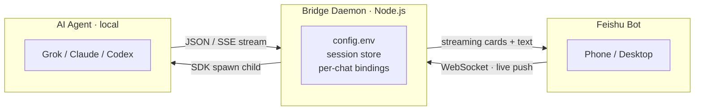

[**中文**](./README.zh.md) | English

# Feishu Agent Bridge

Bridge Feishu / Lark to a **local** coding agent. Mention the bot in a group; it reads code, edits files, and runs commands on your machine. Replies stream back as CardKit v2 cards.

**One repo. Grok · Claude Code · Codex share the same commands, cards, and sessions. No cloud relay of ours — the agent stays on your computer.**

---

## Highlights

### Group collaboration
Each Feishu group has its own session. `/newchat` creates a group and binds a fresh session — one topic, one chat. Teammates can join, watch the run, and send follow-ups.

### Per-group @mention control
Groups require @mention by default so chatter does not wake the agent. `/mention off` sends every message in that group to the agent; `/mention on` restores the gate. DMs always go through. The setting is stored per chat.

### Multi-turn conversations
The same DM or group keeps talking to the same local CLI session. `/stop` aborts the current turn; the next message continues the thread.

### Streaming replies
CardKit v2 updates live: text, tool calls, file edits, token usage. `/cot brief|detailed` splits the process card from a clean answer; `/cot off` keeps everything in one card.

### Session management
| Command | What it does |
|---------|----------------|
| `/new` `/newchat` | New session here, or a new group + session |
| `/list` `/resume` | Discover local CLI sessions and resume one |
| `/bind` | Bind this chat to an existing session id |
| `/cwd` `/ws` | Change cwd; bookmark project paths |
| `/status` `/usage` | Live status and token usage |
| Terminal | `grok --resume` / `claude --resume` / `codex resume` on the same session |

### Multiple agents
One codebase, three engines. Pick with `CTI_AGENT`. Cards and slash commands stay the same:

| Agent | `CTI_AGENT` | Local CLI | Auth |
|-------|-------------|---------|------|
| **Grok** (latest) | `grok` | `grok` | `grok login` → `~/.grok/auth.json` |
| Claude Code | `claude` | `claude` | `claude auth login` or `ANTHROPIC_*` |
| OpenAI Codex | `codex` | `codex` | `codex login` or `OPENAI_API_KEY` |

Give each agent its own Feishu app and process. Do not share one bot across agents.

### Cross-session memory
Before each turn the agent reads `~/.codex-bridge-memory.md` (preferences, project paths, conventions). `/memory` shows it in Feishu. Tell the agent “remember: …” and it updates the file for the next session.

### Also included

- **Permission cards** — writes and shell commands ask first: allow once / allow this session / deny (buttons or `1` `2` `3`)
- **Access control** — `/invite` `/remove` `/access` for users, admins, and whole groups
- **Modes** — `/mode code|plan|ask`
- **Workspace bookmarks** — `/ws save|use|list|remove`
- **File send** — `/sendfile` uploads a local file back to the chat
- **Local-first** — agent, code, and sessions stay on disk; Feishu only carries chat and cards

---

## Runs locally. No cloud relay.

The agent process lives on your machine. Project files, session records, and secrets never go through a backend we host. Feishu only moves chat text and streaming cards.

- **Access control** — `/invite` `/remove` `/access` for users, admins, and whole groups
- **Secret masking** — `config.env` is gitignored; tokens, Bearer headers, and App Secrets are redacted in logs
- **Encrypted transport** — Feishu WebSocket / REST over TLS; the daemon talks to the agent as a local child process, not over the public internet

---

## How it works



```
Feishu Bot (phone / desktop)
        │  WebSocket long-lived · live push
        │  streaming cards + text
        ▼
Bridge Daemon (Node.js)
  config.env · session store · per-chat bindings
        │  SDK spawn child process
        ▼
AI Agent (local)  Grok / Claude / Codex
        │  JSON / SSE stream
        └──────────▶ Daemon updates the Feishu card
```

### Flow

1. **Message in** — Feishu pushes `im.message.receive_v1` over the WebSocket
2. **Route** — `bridge.ts` resolves the per-chat binding (`chatId → sessionId`), handles slash commands, then hands off to the conversation engine
3. **Spawn agent** — the provider (`grok-provider.ts` / `claude-provider.ts` / `codex-provider.ts`) starts the local agent in the working directory via SDK
4. **Event stream** — the agent emits text deltas, tool calls, tool results, and usage
5. **SSE normalize** — the provider maps those events to one SSE shape (`text`, `tool_use`, `tool_result`, `permission_request`, `result`)
6. **Card render** — `conversation.ts` folds SSE into a live Feishu CardKit card
7. **Live update** — card patches go back over the REST API so the group sees progress; writes and shell commands first show a permission card

---

## Install

```bash
git clone https://github.com/opc8838-hub/codex-claude-bridge-feishu.git
cd codex-claude-bridge-feishu
npm install
npm run build
cp config.env.example config.env
```

Edit `config.env`:

```bash
CTI_AGENT=grok
CTI_FEISHU_APP_ID=cli_xxxxxxxx
CTI_FEISHU_APP_SECRET=xxxxxxxx
CTI_DEFAULT_WORKDIR=/path/to/project
CTI_FEISHU_REQUIRE_MENTION=true
CTI_AUTO_APPROVE=false
```

```bash
npm run dev      # or npm start
```

Or globally:

```bash
npm i -g codex-claude-bridge-feishu
codex-bridge setup && codex-bridge run
```

Run several agents (one Feishu app, config, and process each):

```bash
CTI_AGENT=grok   CTI_CONFIG_PATH=config.grok.env   CTI_HOME=.bridge-grok   node dist/daemon.mjs
CTI_AGENT=claude CTI_CONFIG_PATH=config.claude.env CTI_HOME=.bridge-claude node dist/daemon.mjs
CTI_AGENT=codex  CTI_CONFIG_PATH=config.codex.env  CTI_HOME=.bridge-codex  node dist/daemon.mjs
```

### Prerequisites

- Node.js >= 20
- The CLI for the agent you pick (`grok --version` / `claude --version` / `codex --version`)
- One Feishu enterprise self-built app **per agent** (Bot capability, long-connection events, `im.message.receive_v1`, `cardkit:card`, `im:chat*`, `im:resource`)

---

## Commands

`/newchat` `/new` `/list` `/resume` `/bind` `/cwd` `/ws` `/mode` `/mention` `/cot` `/invite` `/remove` `/access` `/status` `/usage` `/stop` `/perm` `/memory` `/sendfile` `/help`

Resume the same Grok session in a terminal:

```bash
grok --resume <session-id>
```

---

## Security

Keep App Secrets in `config.env` (gitignored). Prefer `CTI_AUTO_APPROVE=false` for Grok / Claude. Do not commit secrets.

---

## License

MIT © opc8838-hub
