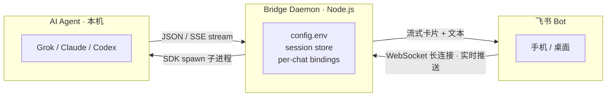

[**English**](./README.md) | 中文

# Feishu Agent Bridge

[Grok Build](https://x.ai/build) · [Grok 文档](https://docs.x.ai/build/overview) · [Claude Code](https://docs.anthropic.com/en/docs/claude-code) · [Codex](https://github.com/openai/codex) · [飞书开放平台](https://open.feishu.cn)

把飞书 / Lark 接到**本机**编程 Agent。群里 @ 一下，Agent 在你电脑上读代码、改文件、跑命令，回复以 CardKit v2 流式卡片回来。

**一个仓库。Grok · Claude Code · Codex 共用同一套命令、卡片和会话。没有自建云中转，Agent 不出你的电脑。**

---

## 亮点

### 群聊协作
每个飞书群独立会话，互不串台。`/newchat` 一键建群并绑定新会话：一个话题一个群，同事可以进群一起看过程、一起下指令。

### 每群 @提及控制
默认群里要 @机器人 才响应，避免闲聊误触发。`/mention off` 后该群每条消息都进 Agent；`/mention on` 立刻恢复。私聊始终直达。每个群单独记，互不影响。

### 多轮会话
同一群 / 同一私聊连续对话，上下文跟本机 CLI 会话对齐。中途可以 `/stop` 打断当前任务，下一条接着聊。

### 流式响应
CardKit v2 边生成边刷：文本、工具调用、改文件、用量实时出现。`/cot brief|detailed` 可把过程卡和干净答案拆开；`/cot off` 全部收在一张卡里。

### 会话管理
| 命令 | 作用 |
|------|------|
| `/new` `/newchat` | 当前聊天开新会话，或拉新群开新会话 |
| `/list` `/resume` | 发现本机 CLI 会话并恢复 |
| `/bind` | 绑到已有会话 ID |
| `/cwd` `/ws` | 切工作目录；书签收藏项目路径 |
| `/status` `/usage` | 当前状态、本会话 / 全量 token |
| 终端 | `grok --resume` / `claude --resume` / `codex resume` 接着同一条会话 |

### 多 Agent
一份代码，三个引擎。用 `CTI_AGENT` 选，卡片和斜杠命令完全一样：

| Agent | `CTI_AGENT` | 本机 CLI | 登录 |
|-------|-------------|---------|------|
| **[Grok](https://x.ai/build)**（最新） | `grok` | `grok` | `grok login` → `~/.grok/auth.json` |
| [Claude Code](https://docs.anthropic.com/en/docs/claude-code) | `claude` | `claude` | `claude auth login` 或 `ANTHROPIC_*` |
| [OpenAI Codex](https://github.com/openai/codex) | `codex` | `codex` | `codex login` 或 `OPENAI_API_KEY` |

每个 Agent 用自己的飞书应用 + 自己的进程，不要共用一个机器人。

### 跨会话记忆
Agent 每次开聊前会读 `~/.codex-bridge-memory.md`（偏好、项目路径、常用约定）。飞书里 `/memory` 查看。直接对 Agent 说「记住：…」，它会改这个文件，下次会话仍在。

### 还有这些

- **权限审批** — 写文件、跑命令先弹卡：允许一次 / 本会话允许 / 拒绝（点按钮或回 `1` `2` `3`）
- **访问控制** — `/invite` `/remove` `/access`：授权用户、管理员、整群
- **模式** — `/mode code|plan|ask`
- **工作区书签** — `/ws save|use|list|remove`
- **发文件** — `/sendfile` 把本机文件推回飞书
- **本地优先** — Agent、代码、会话都在本机；飞书只传聊天和卡片

---

## 本地运行，不走云

Agent 在你电脑上跑。项目文件、会话记录、密钥都留在本机，不经过我们自己的云中转。飞书只负责把消息和流式卡片送来送去。

- **访问控制** — `/invite` `/remove` `/access`，按用户 / 管理员 / 整群授权
- **密钥脱敏** — `config.env` 已 gitignore；日志里的 token、Bearer、App Secret 会打码
- **加密传输** — 飞书 WebSocket / REST 走 TLS；本机到 Agent 是 SDK 拉起的子进程，不经公网

---

## 工作原理



```
飞书 Bot（手机 / 桌面）
        │  WebSocket 长连接 · 实时推送
        │  流式卡片 + 文本
        ▼
Bridge Daemon（Node.js）
  config.env · session store · per-chat bindings
        │  SDK spawn 子进程
        ▼
AI Agent（本机）  Grok / Claude / Codex
        │  JSON / SSE stream
        └──────────▶ Daemon 再刷回飞书卡片
```

### 详细流程

1. **消息到达** — 飞书通过 WebSocket 长连接推送 `im.message.receive_v1` 事件
2. **桥接路由** — `bridge.ts` 解析每群绑定（`chatId → sessionId`），先处理斜杠命令，再交给对话引擎
3. **启动 Agent** — Provider（`grok-provider.ts` / `claude-provider.ts` / `codex-provider.ts`）在工作目录用 SDK 拉起本机 Agent
4. **事件流** — Agent 输出文字增量、工具调用、工具结果、用量信息
5. **SSE 转换** — Provider 把 Agent 事件收成统一 SSE（`text`、`tool_use`、`tool_result`、`permission_request`、`result`）
6. **卡片渲染** — `conversation.ts` 聚合 SSE，构建流式 Feishu CardKit 卡片
7. **实时更新** — 卡片增量经 REST API 推回飞书，群里能看到进度；写文件 / 跑命令会先弹权限卡

---

## 安装

```bash
git clone https://github.com/opc8838-hub/codex-claude-bridge-feishu.git
cd codex-claude-bridge-feishu
npm install
npm run build
cp config.env.example config.env
```

编辑 `config.env`：

```bash
CTI_AGENT=grok
CTI_FEISHU_APP_ID=cli_xxxxxxxx
CTI_FEISHU_APP_SECRET=xxxxxxxx
CTI_DEFAULT_WORKDIR=/path/to/project
CTI_FEISHU_REQUIRE_MENTION=true
CTI_AUTO_APPROVE=false
```

```bash
npm run dev      # 或 npm start
```

或全局安装：

```bash
npm i -g codex-claude-bridge-feishu
codex-bridge setup && codex-bridge run
```

同时跑多个 Agent（三个飞书应用、三份配置、三个进程）：

```bash
CTI_AGENT=grok   CTI_CONFIG_PATH=config.grok.env   CTI_HOME=.bridge-grok   node dist/daemon.mjs
CTI_AGENT=claude CTI_CONFIG_PATH=config.claude.env CTI_HOME=.bridge-claude node dist/daemon.mjs
CTI_AGENT=codex  CTI_CONFIG_PATH=config.codex.env  CTI_HOME=.bridge-codex  node dist/daemon.mjs
```

### 前置

- Node.js >= 20
- 对应 CLI：`grok --version` / `claude --version` / `codex --version`
- 每个 Agent 一个飞书企业自建应用：机器人能力、长连接事件、`im.message.receive_v1`、`cardkit:card`、`im:chat*`、`im:resource`

---

## 命令

`/newchat` `/new` `/list` `/resume` `/bind` `/cwd` `/ws` `/mode` `/mention` `/cot` `/invite` `/remove` `/access` `/status` `/usage` `/stop` `/perm` `/memory` `/sendfile` `/help`

终端恢复同一条 Grok 会话：

```bash
grok --resume <session-id>
```

---

## 安全

App Secret 只放 `config.env`（已 gitignore）。Grok / Claude 建议 `CTI_AUTO_APPROVE=false`。不要提交密钥。

---

## License

MIT © opc8838-hub
